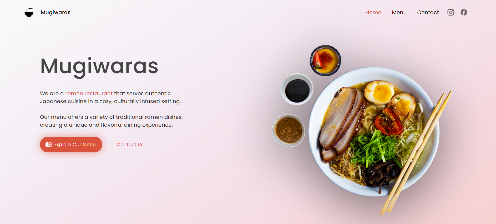
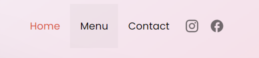
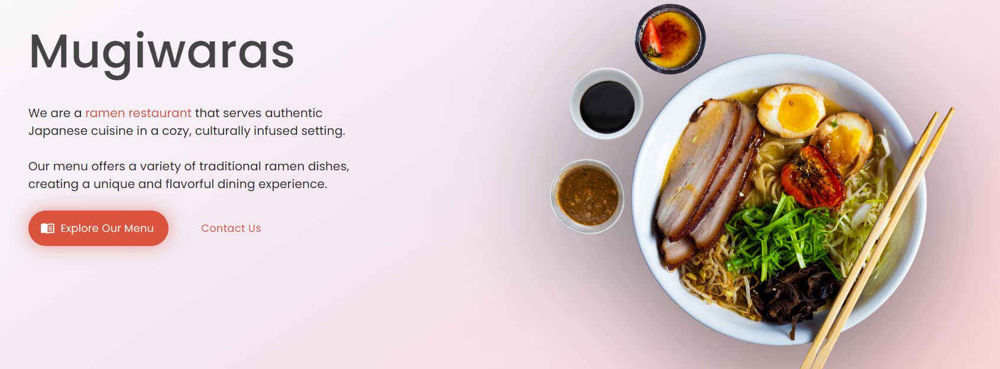
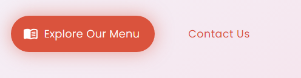
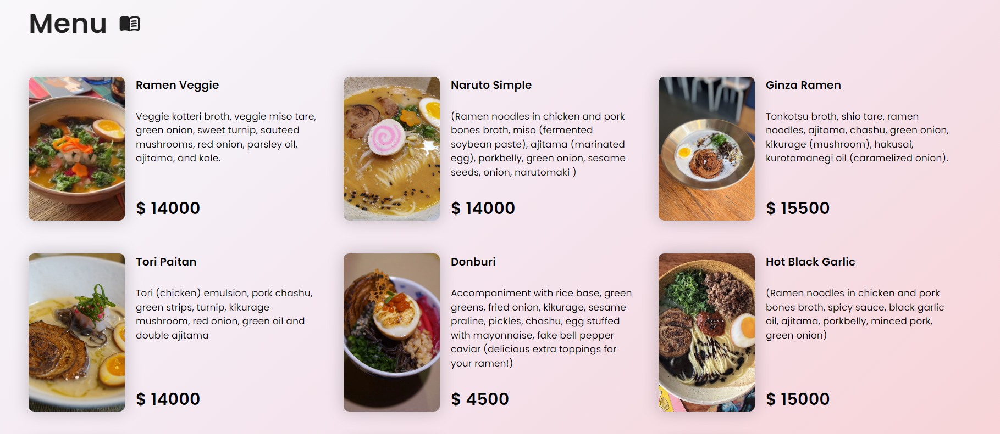
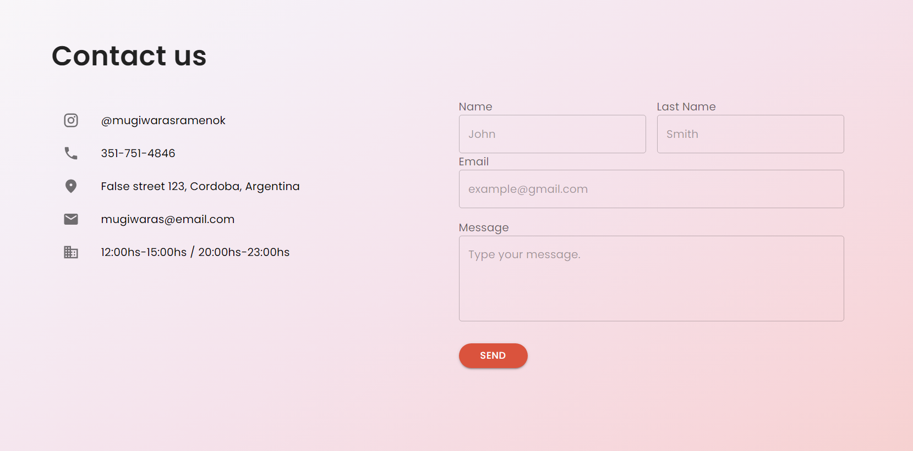
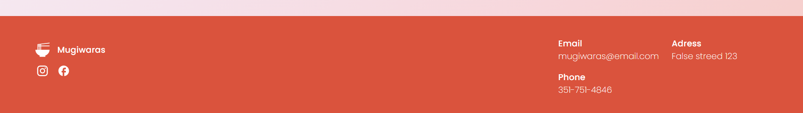

# **MUGIWARAS RAMEN**

## ABOUT

The objective of this project is to go make a presentation of a ramen restaurant located in Córdoba, Argentina.

 
    

## Skills used

 
    

## WEBSITE STRUCTURE / HOW TO USE IT

### ✦ NavBar

On the top of the document I included a navigation bar so be able to switch between each section. This navbar collapses on small devices to a menu bar that you must open to be able to see the links.

 
    

### ✦ Home section

Home is just to show a small presentation with a ilustrative photo of the products that the company sells.

 
    

Yo have two bottons to go to the other sections as well.

 
    

### ✦ Menu section

This section is a list of the products that you can eat at the restaurant with each price. Every product is rendered from a data base in firestore.

 
    

### ✦ Contact section

At this section you can find all the data to be able to contact the restaurant, and a form to write a small message that will send and email to de company.

 
   

### ✦ Footer

This is just a small footer with a part of the information of contact section, with buttons to go to the other social media.

 
   

## NEW KNOWLEDGE APPLIED

### ✦ React

I aplied my knowledge in react using javascript and material ui for custom styles.

## RESOURCES

- CSS Framework -> [Material UI](https://mui.com/material-ui/)
- Data -> FireStore

## CONTACT ME

If you are interested in contacting me, you can find me on the following links:

- [LinkedIn](https://www.linkedin.com/in/romina-rao-50a61a1ba/)
- [raoromina96@gmail.com](mailto:raoromina96@gmail.com)
- [Instagram](https://instagram.com/mae.noart/)
- [Check my other GitHub repositories](https://github.com/RomiRao?tab=repositories)
